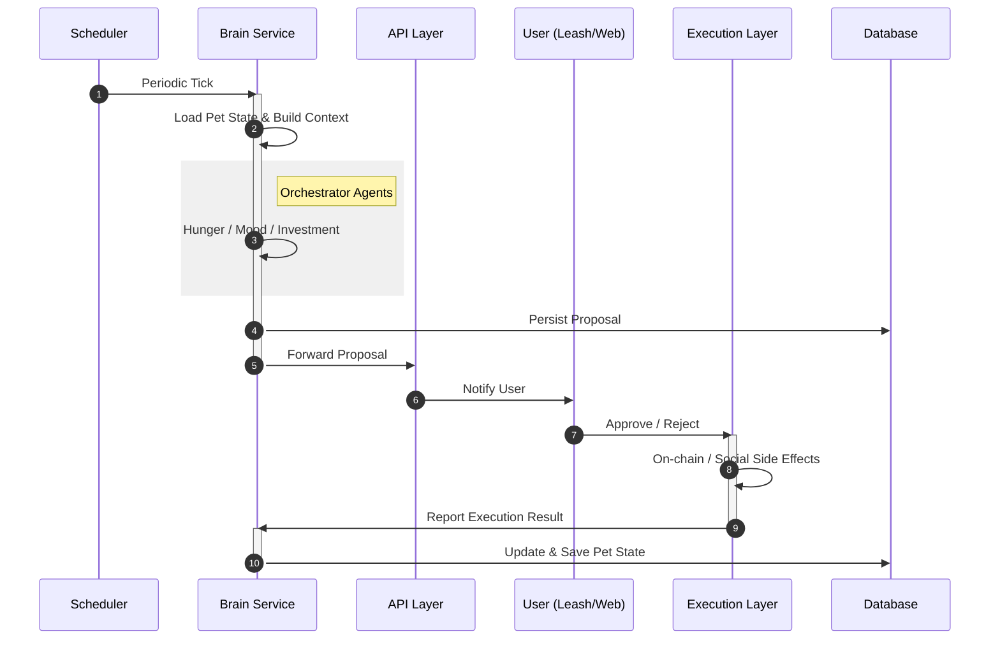
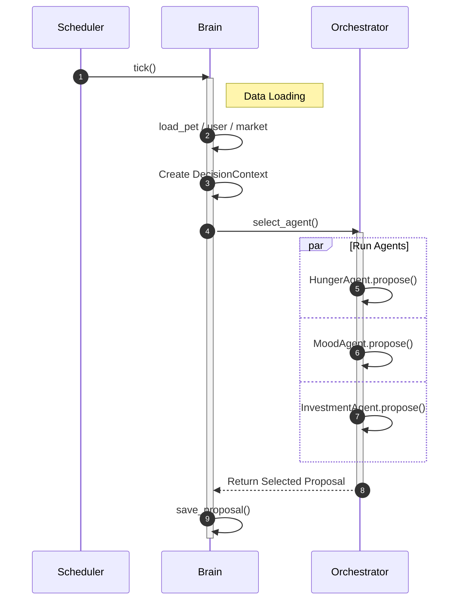
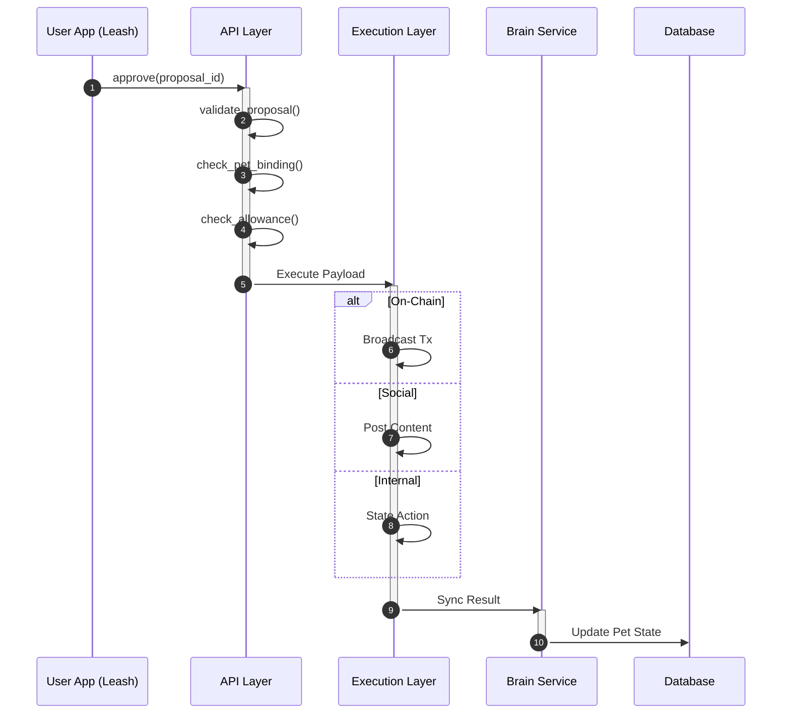

  <pre>
  ██████╗ ███████╗ ██████╗  ██████╗ ████████╗ ██████╗██╗  ██╗██╗
  ██╔══██╗██╔════╝██╔════╝ ██╔═══██╗╚══██╔══╝██╔════╝██║  ██║██║
  ██║  ██║█████╗  ██║  ███╗██║   ██║   ██║   ██║     ███████║██║
  ██║  ██║██╔══╝  ██║   ██║██║   ██║   ██║   ██║     ██╔══██║██║
  ██████╔╝███████╗╚██████╔╝╚██████╔╝   ██║   ╚██████╗██║  ██║██║
  ╚═════╝ ╚══════╝ ╚═════╝  ╚═════╝    ╚═╝    ╚═════╝╚═╝  ╚═╝╚═╝
  </pre>

  <h3>👾 The Sentient Asset Agent on Solana 👾</h3>

  

    <strong>Feed it SOL. Watch it trade. Pray it doesn't get Rekt.</strong>
  

  

    
    
    
  

---
## Degotchi

**Degotchi** is a crypto-native virtual pet system inspired by *Degen culture* and *Tamagotchi*.

A Degotchi is an **on-chain pet with an independent personality**.
It forms opinions, proposes actions, and expresses outcomes — but **never executes financial actions without explicit human approval**.

This project explores **human-in-the-loop AI decision systems** in a Web3 context.

---

### Core Philosophy

* 🧠 **AI suggests, humans decide**
* 🐾 **Pets are first-class on-chain entities**
* 🔐 **No private keys are ever handled by AI**
* 🎮 **Finance as interaction, not automation**

Degotchi is **not** an auto-trading bot.
It is a *personality-driven decision companion*.

---

### System Architecture

The project is organized as a modular full-stack system:

#### 🧠 Brain (Python)

AI decision engine and state orchestration:

* Market signal ingestion
* Personality-driven decision modeling
* Action proposal generation
* Time-based state evolution (hunger, mood, cooldowns)

> Brain can propose actions, but cannot execute them.

---

#### 🧍 Body (Web / React)

User-facing web interface:

* Pet status visualization
* Proposal review
* Interaction history

---

#### 🪢 Leash (Mobile / React Native)

User control and security layer:

* Wallet connection
* Biometric authentication
* Explicit approval or rejection of proposals

> Leash is the only component that can authorize real-world effects.

---

#### 🔗 On-chain Programs (Rust / Solana)

Smart contracts defining:

* Degotchi pet identity (NFT)
* Pet ↔ User binding ("Leash")
* Permission and allowance constraints
* Immutable on-chain ownership logic

---

### Key Concepts

* **Pet-first design**
  Pets exist independently on-chain. Users adopt and bind to them.

* **Human-in-the-loop execution**
  All sensitive actions require explicit user approval.

* **Personality-driven behavior**
  Actions are influenced by pet traits, mood, and experience.

* **Social expression with consent**
  Degotchi can express decisions publicly (e.g. Twitter) only with user authorization.

## Complete data sequenceDiagram
---

## System brain logics

## User concept decisions 

### Technology Stack

* **Blockchain**: Solana
* **Smart Contracts**: Rust
* **Backend / AI**: Python
* **Database**: Supabase (PostgreSQL)
* **Web**: React
* **Mobile**: React Native
* **Infrastructure**: Docker, Nginx, VPS
* **RPC**: Helius

---

### Disclaimer

Degotchi is an experimental project for educational and exploratory purposes.
It does not provide financial advice and does not perform autonomous trading.

---
## 🤝 Contributing

We are building in public. We welcome **Rustaceans**, **Pythonistas**, and **Flutter Devs**.

Please read our [CONTRIBUTING.md](https://github.com/Degotchi/.github/blob/main/CONTRIBUTING.md) before submitting a PR.
*Note: If you rug, I will find you.*

## 📄 License

Code is open-sourced under **MIT License** (Contracts) and **AGPL-3.0** (AI Core). See individual repos for details.

---

  

    <i>Built with ☕, 😭, and ⚡ on Solana.</i> 
    <b>NOT FINANCIAL ADVICE. THE PET MIGHT LOSE YOUR MONEY.</b>
  

